# 🛠️ Admin Area & Model Management Concept

## 🎯 Executive Summary

The **Admin Area** provides enterprise customers with comprehensive control over AI model usage across all ArchMesh processes. This enables organizations to optimize costs, ensure compliance, and maintain control over their AI infrastructure while leveraging the best models for each specific task.

---

## 🏗️ Admin Area Architecture

### **Core Components**

```mermaid
graph TD
    A[Admin Dashboard] --> B[User Management]
    A --> C[Model Configuration]
    A --> D[Usage Analytics]
    A --> E[Cost Tracking]
    A --> F[System Health]
    
    B --> B1[Role-Based Permissions]
    B --> B2[User Activity Logs]
    B --> B3[Access Controls]
    
    C --> C1[Per-Step Model Selection]
    C --> C2[Multiple Model Support]
    C --> C3[A/B Testing]
    C --> C4[Load Balancing]
    
    D --> D1[Real-time Metrics]
    D --> D2[Performance Analytics]
    D --> D3[Usage Patterns]
    
    E --> E1[Cost per Model]
    E --> E2[Budget Controls]
    E --> E3[Spending Alerts]
    
    F --> F1[Model Health Status]
    F --> F2[Response Times]
    F --> F3[Error Rates]
    
    classDef admin fill:#e3f2fd,stroke:#1565c0,stroke-width:2px
    classDef management fill:#f3e5f5,stroke:#4a148c,stroke-width:2px
    classDef analytics fill:#e8f5e8,stroke:#1b5e20,stroke-width:2px
    
    class A admin
    class B,C management
    class D,E,F analytics
```



---

## 🔧 Model Selection System

### **Per-Step Model Configuration**

#### **1. Requirements Analysis**
```yaml
requirements_analysis:
  primary_model:
    provider: "anthropic"
    model: "claude-3-5-sonnet-20241022"
    reasoning: "Best accuracy for requirements extraction"
    cost_tier: "medium"
  
  secondary_model:
    provider: "openai"
    model: "gpt-4"
    reasoning: "Fallback for complex requirements"
    cost_tier: "high"
  
  tertiary_model:
    provider: "deepseek"
    model: "deepseek-r1"
    reasoning: "Cost-effective for simple requirements"
    cost_tier: "free"
```

#### **2. Architecture Design**
```yaml
architecture_design:
  primary_model:
    provider: "anthropic"
    model: "claude-3-5-opus-20241022"
    reasoning: "Best architectural reasoning capabilities"
    cost_tier: "high"
  
  secondary_model:
    provider: "openai"
    model: "gpt-4"
    reasoning: "Technical depth and detail"
    cost_tier: "high"
  
  tertiary_model:
    provider: "anthropic"
    model: "claude-3-5-sonnet-20241022"
    reasoning: "Balanced performance and cost"
    cost_tier: "medium"
```

#### **3. Code Generation**
```yaml
code_generation:
  primary_model:
    provider: "openai"
    model: "gpt-4"
    reasoning: "Superior code generation quality"
    cost_tier: "high"
  
  secondary_model:
    provider: "anthropic"
    model: "claude-3-5-sonnet-20241022"
    reasoning: "Consistent code style and patterns"
    cost_tier: "medium"
  
  tertiary_model:
    provider: "deepseek"
    model: "deepseek-coder"
    reasoning: "Fast and cost-effective for simple code"
    cost_tier: "free"
```

#### **4. Documentation Generation**
```yaml
documentation:
  primary_model:
    provider: "anthropic"
    model: "claude-3-5-opus-20241022"
    reasoning: "Comprehensive and well-structured documentation"
    cost_tier: "high"
  
  secondary_model:
    provider: "anthropic"
    model: "claude-3-5-sonnet-20241022"
    reasoning: "Clear and concise documentation"
    cost_tier: "medium"
  
  tertiary_model:
    provider: "openai"
    model: "gpt-4"
    reasoning: "Technical accuracy and detail"
    cost_tier: "high"
```

---

## 🎛️ Admin Dashboard Features

### **1. User Management Interface**

#### **Role-Based Permissions**
```typescript
interface UserRole {
  name: string;
  permissions: Permission[];
  modelAccess: ModelAccess[];
  costLimits: CostLimits;
}

interface Permission {
  action: 'read' | 'write' | 'admin';
  resource: 'models' | 'users' | 'analytics' | 'costs';
}

interface ModelAccess {
  step: WorkflowStep;
  models: string[];
  restrictions: ModelRestriction[];
}
```

#### **User Activity Monitoring**
- **Login/Logout Tracking**: Monitor user access patterns
- **Model Usage**: Track which models each user accesses
- **Cost Attribution**: Assign costs to specific users/projects
- **Performance Impact**: Monitor user impact on system performance

### **2. Model Configuration Interface**

#### **Drag-and-Drop Model Selection**
```typescript
interface ModelConfiguration {
  step: WorkflowStep;
  models: ModelConfig[];
  loadBalancing: LoadBalancingConfig;
  fallbackStrategy: FallbackStrategy;
  aBTesting: ABTestingConfig;
}

interface ModelConfig {
  id: string;
  provider: string;
  model: string;
  priority: 'primary' | 'secondary' | 'tertiary';
  weight: number; // For load balancing
  costLimit: number;
  performanceThreshold: PerformanceThreshold;
}
```

#### **A/B Testing Configuration**
```typescript
interface ABTestingConfig {
  enabled: boolean;
  testGroups: TestGroup[];
  metrics: Metric[];
  duration: number; // days
  successCriteria: SuccessCriteria;
}

interface TestGroup {
  name: string;
  models: ModelConfig[];
  trafficPercentage: number;
  startDate: Date;
  endDate: Date;
}
```

### **3. Usage Analytics Dashboard**

#### **Real-time Metrics**
```typescript
interface AnalyticsDashboard {
  realTimeMetrics: RealTimeMetrics;
  historicalData: HistoricalData;
  performanceMetrics: PerformanceMetrics;
  costAnalytics: CostAnalytics;
}

interface RealTimeMetrics {
  activeUsers: number;
  requestsPerMinute: number;
  averageResponseTime: number;
  errorRate: number;
  modelUtilization: ModelUtilization[];
}
```

#### **Performance Analytics**
- **Response Time Trends**: Track model performance over time
- **Accuracy Metrics**: Monitor model output quality
- **Error Rate Analysis**: Identify problematic models or steps
- **Throughput Monitoring**: Track system capacity and bottlenecks

### **4. Cost Tracking & Budgeting**

#### **Cost per Model Tracking**
```typescript
interface CostTracking {
  totalCost: number;
  costByModel: CostByModel[];
  costByUser: CostByUser[];
  costByProject: CostByProject[];
  budgetAlerts: BudgetAlert[];
}

interface CostByModel {
  model: string;
  provider: string;
  totalCost: number;
  requests: number;
  averageCostPerRequest: number;
  costTrend: CostTrend;
}
```

#### **Budget Controls**
```typescript
interface BudgetControls {
  monthlyBudget: number;
  dailyBudget: number;
  perUserBudget: number;
  perProjectBudget: number;
  alertThresholds: AlertThreshold[];
  spendingLimits: SpendingLimit[];
}
```

### **5. System Health Monitoring**

#### **Model Health Status**
```typescript
interface SystemHealth {
  modelStatus: ModelStatus[];
  systemMetrics: SystemMetrics;
  alerts: Alert[];
  recommendations: Recommendation[];
}

interface ModelStatus {
  model: string;
  status: 'healthy' | 'degraded' | 'down';
  responseTime: number;
  errorRate: number;
  lastChecked: Date;
  issues: Issue[];
}
```

#### **Performance Monitoring**
- **Response Time Tracking**: Monitor each model's performance
- **Error Rate Monitoring**: Track and alert on high error rates
- **Capacity Planning**: Monitor system load and scaling needs
- **Health Checks**: Automated model availability testing

---

## 🔒 Enterprise Security & Compliance

### **1. API Key Management**
```typescript
interface APIKeyManagement {
  encryption: EncryptionConfig;
  rotation: RotationConfig;
  access: AccessConfig;
  audit: AuditConfig;
}

interface EncryptionConfig {
  algorithm: 'AES-256';
  keyRotation: 'monthly' | 'quarterly';
  secureStorage: 'vault' | 'database';
}
```

### **2. Audit Logging**
```typescript
interface AuditLog {
  timestamp: Date;
  user: string;
  action: string;
  resource: string;
  model: string;
  cost: number;
  result: 'success' | 'failure';
  details: Record<string, any>;
}
```

### **3. Compliance Features**
- **Data Governance**: Track data usage and retention
- **Privacy Controls**: Ensure sensitive data protection
- **Regulatory Compliance**: Support for GDPR, HIPAA, etc.
- **Access Logging**: Complete audit trail of all actions

---

## 📊 Advanced Features

### **1. Machine Learning Optimization**
```typescript
interface MLOptimization {
  modelSelection: ModelSelectionML;
  costOptimization: CostOptimizationML;
  performancePrediction: PerformancePredictionML;
}

interface ModelSelectionML {
  enabled: boolean;
  algorithm: 'reinforcement_learning' | 'genetic_algorithm';
  metrics: Metric[];
  trainingData: TrainingData;
}
```

### **2. Custom Model Integration**
```typescript
interface CustomModelIntegration {
  endpoints: CustomEndpoint[];
  authentication: AuthenticationConfig;
  loadBalancing: LoadBalancingConfig;
  monitoring: MonitoringConfig;
}

interface CustomEndpoint {
  name: string;
  url: string;
  authentication: AuthenticationMethod;
  rateLimits: RateLimit[];
  healthCheck: HealthCheckConfig;
}
```

### **3. Advanced Analytics**
- **Predictive Analytics**: Forecast usage and costs
- **Anomaly Detection**: Identify unusual patterns
- **Optimization Recommendations**: Suggest model configurations
- **Trend Analysis**: Long-term usage and performance trends

---

## 🎯 Business Value

### **Cost Optimization**
- **Model Selection**: Choose the most cost-effective model for each task
- **Load Balancing**: Distribute requests to optimize costs
- **Budget Controls**: Prevent overspending with automated limits
- **Cost Attribution**: Track costs by user, project, or department

### **Performance Optimization**
- **A/B Testing**: Compare model performance objectively
- **Load Balancing**: Optimize system performance
- **Fallback Mechanisms**: Ensure high availability
- **Performance Monitoring**: Proactive issue detection

### **Enterprise Control**
- **Custom Models**: Use internal or specialized models
- **Compliance**: Meet regulatory requirements
- **Security**: Secure API key and data management
- **Audit Trail**: Complete visibility into system usage

### **Scalability**
- **Multi-Model Support**: Handle high-volume requests
- **Load Distribution**: Scale across multiple models
- **Performance Monitoring**: Proactive scaling decisions
- **Cost Management**: Scale cost-effectively

---

## 🚀 Implementation Roadmap

### **Phase 1: Core Admin Features (Week 7)**
- [ ] User management interface
- [ ] Basic model configuration
- [ ] Usage analytics dashboard
- [ ] Cost tracking system

### **Phase 2: Advanced Model Management (Week 8)**
- [ ] Per-step model configuration
- [ ] A/B testing capabilities
- [ ] Load balancing system
- [ ] Custom model integration

### **Phase 3: Enterprise Features (Week 9)**
- [ ] Advanced security controls
- [ ] Compliance features
- [ ] Machine learning optimization
- [ ] Predictive analytics

This Admin Area concept provides enterprise customers with the control and visibility they need to effectively manage their AI infrastructure while optimizing costs and performance.
