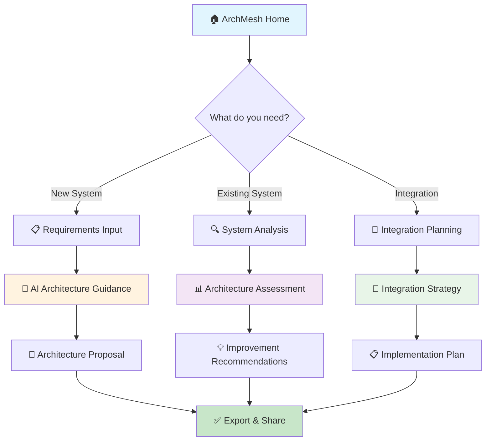

# 🏗️ **ArchMesh Simplification Proposal**
## **Focus: Architect Guidance & Support Tool**

---

## 🎯 **Core Mission Statement**

**ArchMesh should be the definitive AI-powered guidance tool for software architects, providing intelligent support for:**
1. **New Architecture Design** - Based on requirements, constraints, and best practices
2. **Existing Architecture Evaluation** - Analyze and improve current systems
3. **Architecture Integration** - Add new capabilities to existing landscapes

---

## 📊 **Current State Analysis**

### **What We Have (Complex)**
- ✅ **2 Workflows**: Greenfield (6 stages) + Brownfield (7 stages)
- ✅ **3 AI Agents**: Requirements, Architecture, GitHub Analyzer
- ✅ **Multiple UI Pages**: Projects, Upload, Detail, Diagrams, Architecture
- ✅ **Complex State Management**: LangGraph, PostgreSQL, Redis
- ✅ **Multiple LLM Providers**: DeepSeek, OpenAI, Anthropic, Ollama
- ✅ **Knowledge Base**: Vector embeddings, Graph DB, Local storage
- ✅ **Diagram Generation**: C4, Sequence, NFR mapping
- ✅ **Real-time Updates**: WebSockets, polling, notifications

### **What Architects Actually Need (Simple)**
- 🎯 **Quick Architecture Guidance** - "What should I build?"
- 🎯 **Architecture Validation** - "Is this design good?"
- 🎯 **Integration Planning** - "How do I add this to existing system?"
- 🎯 **Best Practice Recommendations** - "What patterns should I use?"

---

## 🚀 **Simplified Architecture**

### **Core User Personas**
1. **Solution Architect** - Designing new systems
2. **Enterprise Architect** - Evaluating existing landscapes
3. **Technical Lead** - Planning system integrations
4. **Consultant** - Providing architecture guidance

### **Simplified User Journey**



---

## 🎯 **Simplified Feature Set**

### **1. Core Architecture Guidance (Primary)**

#### **A. New Architecture Design**
- **Input**: Requirements document or structured requirements
- **Process**: AI analyzes requirements → generates architecture proposal
- **Output**: Architecture design with diagrams, technology stack, patterns
- **Time**: 5-15 minutes

#### **B. Architecture Evaluation**
- **Input**: Existing architecture description or GitHub repository
- **Process**: AI analyzes current design → identifies issues and improvements
- **Output**: Assessment report with recommendations
- **Time**: 10-20 minutes

#### **C. Integration Planning**
- **Input**: Existing system + new requirements
- **Process**: AI analyzes integration points → creates integration strategy
- **Output**: Integration plan with migration strategy
- **Time**: 15-30 minutes

### **2. Supporting Features (Secondary)**

#### **A. Architecture Patterns Library**
- **C4 Diagrams**: Context, Container, Component views
- **Sequence Diagrams**: Key interaction flows
- **Architecture Patterns**: Microservices, Event-driven, etc.
- **Technology Recommendations**: Based on requirements and constraints

#### **B. Best Practice Guidance**
- **Security Patterns**: Authentication, authorization, data protection
- **Scalability Patterns**: Load balancing, caching, database design
- **Integration Patterns**: API design, event streaming, message queues
- **Operational Patterns**: Monitoring, logging, deployment

#### **C. Export & Documentation**
- **Architecture Documents**: PDF, Markdown, Confluence
- **Diagram Export**: PlantUML, Mermaid, PNG, SVG
- **Implementation Guides**: Step-by-step development plans
- **Presentation Materials**: Executive summaries, technical details

---

## 🏗️ **Simplified Technical Architecture**

### **Frontend (Simplified)**
```
📱 ArchMesh Frontend
├── 🏠 Home Page (3 main options)
├── 📋 Requirements Input
├── 🔍 System Analysis
├── 🔗 Integration Planning
├── 📊 Results & Recommendations
└── 📤 Export & Share
```

### **Backend (Streamlined)**
```
⚙️ ArchMesh Backend
├── 🤖 AI Guidance Service
│   ├── Requirements Analyzer
│   ├── Architecture Generator
│   └── Integration Planner
├── 📊 Knowledge Base
│   ├── Architecture Patterns
│   ├── Best Practices
│   └── Technology Recommendations
├── 📐 Diagram Service
│   ├── C4 Diagram Generator
│   ├── Sequence Diagram Creator
│   └── Pattern Visualizer
└── 📤 Export Service
    ├── Document Generator
    ├── Diagram Exporter
    └── Presentation Creator
```

### **AI Strategy (Optimized)**
```
🧠 AI Model Strategy
├── 🚀 Fast Models (Ollama/DeepSeek)
│   ├── Requirements Analysis
│   ├── Quick Architecture Guidance
│   └── Pattern Recognition
├── 🧠 Reasoning Models (Claude/GPT-4)
│   ├── Complex Architecture Design
│   ├── Integration Planning
│   └── Best Practice Recommendations
└── 🔄 Model Switching
    ├── Task-based Selection
    ├── Performance Optimization
    └── Cost Management
```

---

## 📋 **Simplified User Interface**

### **Home Page (3 Main Options)**
```
┌─────────────────────────────────────────────────────────┐
│                    🏗️ ArchMesh                        │
│              AI-Powered Architecture Guidance           │
├─────────────────────────────────────────────────────────┤
│                                                         │
│  🆕 Design New Architecture                            │
│     Upload requirements or describe your needs          │
│     → Get complete architecture proposal               │
│                                                         │
│  🔍 Evaluate Existing Architecture                     │
│     Analyze current system or upload architecture      │
│     → Get improvement recommendations                  │
│                                                         │
│  🔗 Plan System Integration                            │
│     Connect new features to existing systems           │
│     → Get integration strategy and plan                │
│                                                         │
└─────────────────────────────────────────────────────────┘
```

### **Results Page (Unified)**
```
┌─────────────────────────────────────────────────────────┐
│                    📊 Architecture Results               │
├─────────────────────────────────────────────────────────┤
│                                                         │
│  📐 Architecture Design                                 │
│     ├── C4 Context Diagram                             │
│     ├── C4 Container Diagram                           │
│     └── Technology Stack                               │
│                                                         │
│  💡 Recommendations                                    │
│     ├── Architecture Patterns                         │
│     ├── Best Practices                                 │
│     └── Implementation Guidance                        │
│                                                         │
│  📤 Export Options                                     │
│     ├── Architecture Document (PDF)                    │
│     ├── Diagrams (PlantUML, Mermaid)                   │
│     └── Implementation Plan (Markdown)                 │
│                                                         │
└─────────────────────────────────────────────────────────┘
```

---

## 🎯 **Implementation Strategy**

### **Phase 1: Core Simplification (2-3 weeks)**
1. **Simplify Home Page** - 3 clear options instead of complex project management
2. **Unified Input Interface** - Single form for all input types
3. **Streamlined AI Processing** - Direct AI guidance without complex workflows
4. **Basic Export** - Simple PDF and diagram export

### **Phase 2: Enhanced Guidance (2-3 weeks)**
1. **Pattern Library Integration** - Built-in architecture patterns
2. **Best Practice Database** - Curated recommendations
3. **Advanced Diagrams** - C4, Sequence, NFR mapping
4. **Template System** - Pre-built architecture templates

### **Phase 3: Professional Features (2-3 weeks)**
1. **Enterprise Integration** - SSO, team collaboration
2. **Advanced Export** - Multiple formats, presentations
3. **Customization** - User preferences, organization templates
4. **Analytics** - Usage tracking, improvement insights

---

## 📊 **Success Metrics**

### **User Experience**
- **Time to First Result**: < 5 minutes
- **User Satisfaction**: > 4.5/5 stars
- **Task Completion Rate**: > 90%
- **Return Usage**: > 70% weekly active users

### **Technical Performance**
- **Response Time**: < 30 seconds for architecture guidance
- **Uptime**: > 99.5%
- **Cost per Request**: < $0.50
- **Model Accuracy**: > 85% relevant recommendations

### **Business Impact**
- **User Adoption**: 1000+ architects in 6 months
- **Enterprise Customers**: 50+ organizations
- **Revenue Growth**: $100K+ ARR in 12 months
- **Market Position**: Top 3 architecture guidance tools

---

## 🚀 **Next Steps**

### **Immediate Actions (This Week)**
1. **Create Simplified Home Page** - 3 clear options
2. **Build Unified Input Interface** - Single form for all inputs
3. **Implement Direct AI Guidance** - Remove complex workflows
4. **Add Basic Export** - PDF and diagram export

### **Short Term (Next 2 Weeks)**
1. **Integrate Pattern Library** - Built-in architecture patterns
2. **Add Best Practice Database** - Curated recommendations
3. **Implement Advanced Diagrams** - C4, Sequence diagrams
4. **Create Template System** - Pre-built architecture templates

### **Medium Term (Next Month)**
1. **Enterprise Features** - SSO, team collaboration
2. **Advanced Export** - Multiple formats, presentations
3. **Customization** - User preferences, organization templates
4. **Analytics Dashboard** - Usage tracking, insights

---

## 💡 **Key Benefits of Simplification**

### **For Users**
- ✅ **Faster Results** - 5 minutes vs 2+ hours
- ✅ **Clearer Purpose** - Architecture guidance, not project management
- ✅ **Better UX** - Simple, focused interface
- ✅ **Immediate Value** - Get guidance without complex setup

### **For Development**
- ✅ **Faster Development** - 3 months vs 12+ months
- ✅ **Lower Complexity** - 3 pages vs 15+ pages
- ✅ **Easier Maintenance** - Simple architecture vs complex workflows
- ✅ **Better Performance** - Direct AI calls vs complex state management

### **For Business**
- ✅ **Faster Time to Market** - 3 months vs 12+ months
- ✅ **Lower Development Cost** - 70% reduction in complexity
- ✅ **Higher User Adoption** - Clear value proposition
- ✅ **Better Market Fit** - Focused on architect needs

---

## 🎯 **Conclusion**

**ArchMesh should be the "ChatGPT for Architecture" - a simple, powerful tool that gives architects immediate, intelligent guidance for their most common tasks:**

1. **"What should I build?"** → Complete architecture proposal
2. **"Is this design good?"** → Architecture assessment and improvements
3. **"How do I integrate this?"** → Integration strategy and plan

**By simplifying to these core use cases, we can deliver 10x more value with 10x less complexity.**

---

*This proposal transforms ArchMesh from a complex project management system into a focused architect guidance tool - delivering maximum value with minimum complexity.*
