# 🎨 ArchMesh Diagram Generation System

## Overview

The ArchMesh Diagram Generation System provides comprehensive diagram creation capabilities for both greenfield and brownfield projects, including C4 synthesis, sequence diagrams, and NFR mapping with PlantUML and Mermaid output formats.

## 🚀 Features

### 1. C4 Synthesis (Context & Containers)
- **Context Diagrams**: System boundaries and external actors
- **Container Diagrams**: High-level architecture with containers
- **Component Diagrams**: Detailed component interactions
- **Code Diagrams**: Implementation details
- **PlantUML Integration**: Full C4-PlantUML support
- **Mermaid Fallback**: GitHub-compatible diagrams
- **Round-trip Editing**: Update knowledge graph from diagram edits

### 2. Sequence Diagrams for Key Use-Cases
- **Workflow-driven**: Generated from interface events and workflow paths
- **Actor Identification**: Automatic actor extraction from workflow data
- **Interaction Mapping**: Detailed interaction flows
- **Multiple Scenarios**: Support for multiple use-case scenarios
- **High-priority Focus**: At least one sequence per high-priority scenario

### 3. NFR Mapping & Trade-off Notes
- **Latency Budgets**: Component-level latency requirements
- **Throughput Analysis**: System throughput requirements
- **SLOs Integration**: Service Level Objectives mapping
- **Trade-off Analysis**: Automatic conflict detection
- **Component Mapping**: NFR to component relationships
- **Visual Indicators**: Clear trade-off visualization

## 🏗️ Architecture

### Backend Services

#### Diagram Generation Service (`app/services/diagram_generation_service.py`)
```python
class DiagramGenerationService:
    async def generate_c4_diagram(architecture_data, config, knowledge_context)
    async def generate_sequence_diagram(workflow_data, use_cases, config)
    async def generate_nfr_mapping(architecture_data, nfr_requirements, config)
```

#### Enhanced Knowledge Base Service (`app/services/enhanced_knowledge_base_service.py`)
```python
class EnhancedKnowledgeBaseService:
    async def add_knowledge(knowledge_type, content, metadata, source, project_id)
    async def search_knowledge(context)
    async def synthesize_knowledge(context, synthesis_type)
    async def refine_knowledge(entity_id, refined_content, refinement_metadata)
```

### API Endpoints (`app/api/v1/diagrams.py`)

#### C4 Diagram Generation
```http
POST /api/v1/diagrams/c4
Content-Type: application/json

{
  "project_id": "uuid",
  "workflow_id": "uuid",
  "diagram_type": "c4_context|c4_container|c4_component",
  "title": "Diagram Title",
  "description": "Diagram Description",
  "include_nfr": true,
  "include_technology_stack": true,
  "include_data_flows": true,
  "include_security": true,
  "include_monitoring": true
}
```

#### Sequence Diagram Generation
```http
POST /api/v1/diagrams/sequence
Content-Type: application/json

{
  "project_id": "uuid",
  "workflow_id": "uuid",
  "use_cases": ["User Registration", "Order Processing"],
  "title": "Sequence Diagrams",
  "description": "Key use-case sequences"
}
```

#### NFR Mapping Generation
```http
POST /api/v1/diagrams/nfr-mapping
Content-Type: application/json

{
  "project_id": "uuid",
  "workflow_id": "uuid",
  "nfr_requirements": [
    {
      "id": "performance",
      "name": "Response Time",
      "metric": "latency",
      "target_value": "200",
      "unit": "ms",
      "priority": "high",
      "affected_components": ["api-gateway", "web-app"]
    }
  ],
  "title": "NFR Mapping",
  "description": "Non-functional requirements mapping"
}
```

### Frontend Components

#### Architecture Diagrams Component (`components/ArchitectureDiagrams.tsx`)
- **Interactive Generation**: One-click diagram generation
- **Multiple Formats**: Mermaid and PlantUML support
- **Real-time Preview**: Live diagram rendering
- **Export Capabilities**: Download in multiple formats
- **Template Support**: Pre-configured diagram templates

## 📊 Knowledge Base Integration

### Workflow-Driven Knowledge Collection

The system automatically collects knowledge during workflow execution:

1. **Requirements Analysis**: Extracts functional and non-functional requirements
2. **Architecture Design**: Captures architectural decisions and patterns
3. **Constraint Identification**: Records business and technical constraints
4. **Stakeholder Input**: Incorporates stakeholder feedback and preferences
5. **Technology Decisions**: Tracks technology stack choices and rationale

### Iterative Knowledge Refinement

- **LLM-Assisted Refinement**: Uses multiple LLMs for knowledge validation
- **Cross-Validation**: Ensures knowledge consistency across sources
- **Quality Assessment**: Continuous quality improvement
- **Context Enrichment**: Adds contextual information to knowledge entities

### Multi-Modal Knowledge Storage

- **Text Knowledge**: Requirements, descriptions, decisions
- **Diagram Knowledge**: Visual representations and relationships
- **Metadata Knowledge**: Timestamps, sources, confidence scores
- **Relationship Knowledge**: Dependencies, influences, trade-offs

## 🔄 Workflow Integration

### Greenfield Projects

1. **Requirements Collection**: Workflow-driven requirement gathering
2. **Architecture Evolution**: Iterative architecture refinement
3. **Knowledge Growth**: Continuous knowledge base expansion
4. **Diagram Generation**: Automated diagram creation from knowledge

### Brownfield Projects

1. **Existing System Analysis**: GitHub repository analysis
2. **Knowledge Extraction**: Architecture and technology extraction
3. **Integration Planning**: New feature integration strategies
4. **Visual Documentation**: Comprehensive system documentation

## 🎯 Usage Examples

### C4 Context Diagram
```plantuml
@startuml
!include https://raw.githubusercontent.com/plantuml-stdlib/C4-PlantUML/master/C4_Context.puml

title E-commerce Platform - Context
note right: High-level view of e-commerce system

Person(customer, "Customer", "Online shopper")
Person(admin, "Admin", "System administrator")

System(ecommerce, "E-commerce Platform", "Online shopping platform")

Rel(customer, ecommerce, "Browses, purchases")
Rel(admin, ecommerce, "Manages")

@enduml
```

### Sequence Diagram


### NFR Mapping

```mermaid
graph TB
    %% NFR Mapping and Trade-off Analysis
    api-gateway["🏗️ API Gateway<br/>NFRs:<br/>- Response Time: 200 ms<br/>- Throughput: 1000 rps"]
    web-app["🏗️ Web App<br/>NFRs:<br/>- Response Time: 200 ms<br/>- Security: OAuth2"]
    auth-service["🏗️ Auth Service<br/>NFRs:<br/>- Security: OAuth2<br/>- Availability: 99.9%"]
    
    %% Trade-offs
    api-gateway -.->|Trade-off| api-gateway
    web-app -.->|Trade-off| web-app
```


## 🔧 Configuration

### Environment Variables
```bash
# Diagram Generation
DIAGRAM_STORAGE_PATH=./diagram_storage
EMBEDDING_MODEL=all-MiniLM-L6-v2

# Knowledge Base
KNOWLEDGE_BASE_PATH=./knowledge_base
NEO4J_URI=bolt://localhost:7687
NEO4J_USER=neo4j
NEO4J_PASSWORD=password

# LLM Configuration
DEFAULT_LLM_PROVIDER=deepseek
DEEPSEEK_BASE_URL=http://localhost:11434
DEEPSEEK_MODEL=deepseek-coder
```

### Diagram Templates
```json
{
  "templates": [
    {
      "id": "ecommerce_c4_context",
      "name": "E-commerce C4 Context",
      "type": "c4_context",
      "template": {
        "title": "E-commerce Platform - Context",
        "include_nfr": true,
        "include_technology_stack": true
      }
    }
  ]
}
```

## 📈 Performance Considerations

### Diagram Generation
- **Caching**: Generated diagrams are cached for performance
- **Async Processing**: Non-blocking diagram generation
- **Background Tasks**: Large diagrams generated in background
- **Incremental Updates**: Only regenerate changed components

### Knowledge Base
- **Vector Search**: Efficient semantic similarity search
- **Indexing**: Optimized knowledge indexing
- **Compression**: Knowledge compression for storage efficiency
- **Partitioning**: Project-based knowledge partitioning

## 🧪 Testing

### Unit Tests
```python
def test_c4_diagram_generation():
    service = DiagramGenerationService()
    result = await service.generate_c4_diagram(architecture_data, config)
    assert result["plantuml_code"] is not None
    assert result["mermaid_code"] is not None

def test_sequence_diagram_generation():
    service = DiagramGenerationService()
    result = await service.generate_sequence_diagram(workflow_data, use_cases, config)
    assert len(result["sequence_diagrams"]) > 0
```

### Integration Tests
```python
def test_diagram_api_endpoints():
    response = client.post("/api/v1/diagrams/c4", json=c4_request)
    assert response.status_code == 200
    assert "plantuml_code" in response.json()
```

## 🚀 Future Enhancements

### Planned Features
1. **Real-time Collaboration**: Multi-user diagram editing
2. **Version Control**: Diagram versioning and history
3. **AI-Assisted Design**: LLM-powered architecture suggestions
4. **Integration APIs**: Third-party tool integrations
5. **Advanced Analytics**: Architecture metrics and insights

### Research Areas
1. **Automated Architecture**: AI-generated architecture patterns
2. **Performance Prediction**: NFR impact modeling
3. **Security Analysis**: Automated security pattern detection
4. **Compliance Checking**: Regulatory compliance validation

## 📚 References

- [C4 Model](https://c4model.com/)
- [PlantUML C4-PlantUML](https://github.com/plantuml-stdlib/C4-PlantUML)
- [Mermaid Diagrams](https://mermaid-js.github.io/mermaid/)
- [Architecture Decision Records](https://adr.github.io/)
- [Non-Functional Requirements](https://en.wikipedia.org/wiki/Non-functional_requirement)

---

*This system provides comprehensive diagram generation capabilities for modern software architecture, enabling teams to create, maintain, and evolve architectural documentation as part of their development workflow.*
