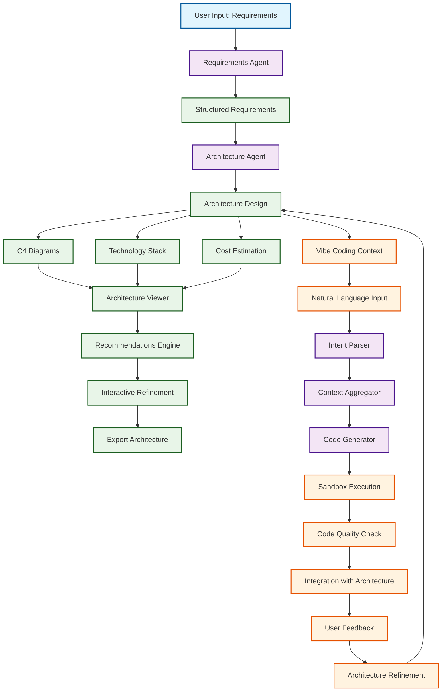
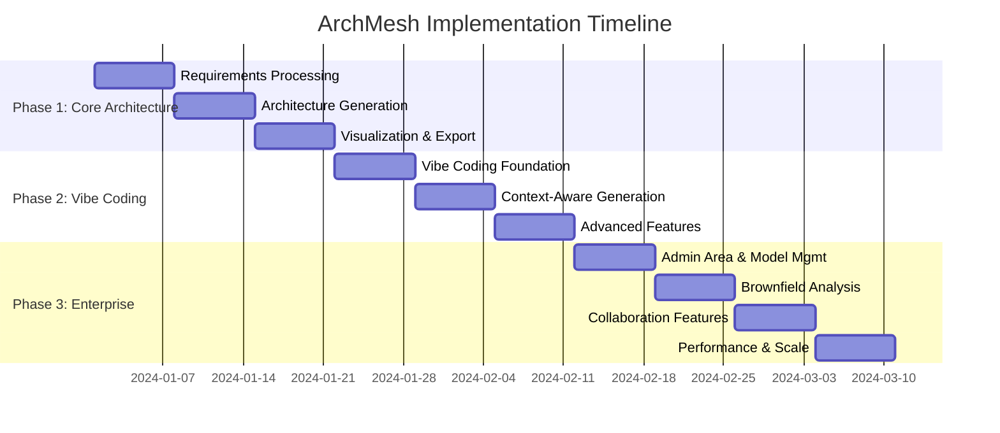
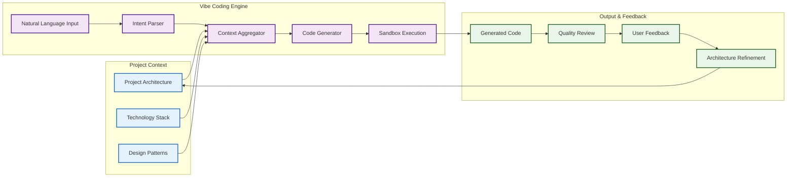
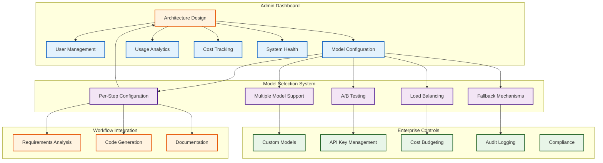
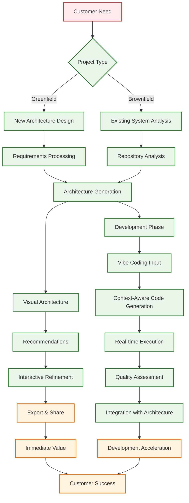

# 🎯 ArchMesh Implementation Flow Diagram

## Customer Journey & Vibe Coding Integration

## Implementation Phases

## Vibe Coding Integration Architecture

## Admin Area & Model Management Flow

## Customer Value Delivery Flow

