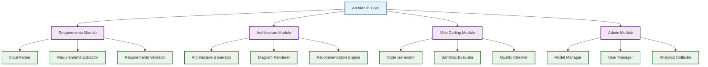
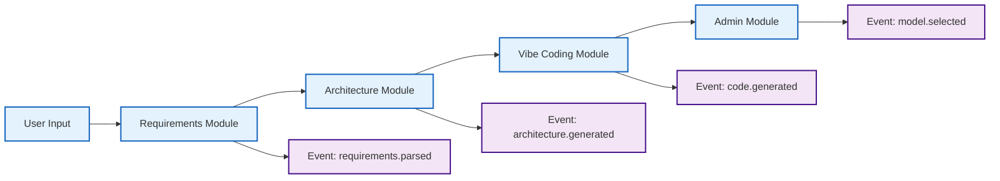

# 🎯 ArchMesh - Simple & Modular Implementation Plan

## 🧩 Core Principle: Simple & Modular

**Every component should be:**
- ✅ **Simple**: Easy to understand and implement
- ✅ **Modular**: Independent, reusable, and composable
- ✅ **Focused**: Single responsibility per module
- ✅ **Testable**: Clear inputs and outputs

---

## 🏗️ Modular Architecture

### **Core Modules**



---

## 📦 Simple Module Design

### **1. Requirements Module**
**Purpose**: Extract and structure requirements from user input

```typescript
// Simple interface
interface RequirementsModule {
  parse(input: string): ParsedRequirements;
  validate(requirements: ParsedRequirements): ValidationResult;
  structure(requirements: ParsedRequirements): StructuredRequirements;
}

// Single responsibility components
class InputParser {
  parse(text: string): ParsedInput;
}

class RequirementsExtractor {
  extract(input: ParsedInput): ExtractedRequirements;
}

class RequirementsValidator {
  validate(requirements: ExtractedRequirements): ValidationResult;
}
```

### **2. Architecture Module**
**Purpose**: Generate architecture based on requirements

```typescript
// Simple interface
interface ArchitectureModule {
  generate(requirements: StructuredRequirements): Architecture;
  render(architecture: Architecture): Diagrams;
  recommend(architecture: Architecture): Recommendations;
}

// Single responsibility components
class ArchitectureGenerator {
  generate(requirements: StructuredRequirements): Architecture;
}

class DiagramRenderer {
  render(architecture: Architecture): Diagrams;
}

class RecommendationEngine {
  recommend(architecture: Architecture): Recommendations;
}
```

### **3. Vibe Coding Module**
**Purpose**: Generate code from natural language

```typescript
// Simple interface
interface VibeCodingModule {
  generate(intent: string, context: ProjectContext): GeneratedCode;
  execute(code: GeneratedCode): ExecutionResult;
  validate(code: GeneratedCode): ValidationResult;
}

// Single responsibility components
class CodeGenerator {
  generate(intent: string, context: ProjectContext): GeneratedCode;
}

class SandboxExecutor {
  execute(code: GeneratedCode): ExecutionResult;
}

class QualityChecker {
  validate(code: GeneratedCode): ValidationResult;
}
```

### **4. Admin Module**
**Purpose**: Manage models and users

```typescript
// Simple interface
interface AdminModule {
  configureModels(config: ModelConfig): void;
  manageUsers(users: User[]): void;
  trackUsage(metrics: UsageMetrics): void;
}

// Single responsibility components
class ModelManager {
  configure(config: ModelConfig): void;
  selectModel(step: WorkflowStep): Model;
}

class UserManager {
  manage(users: User[]): void;
  assignRoles(user: User, roles: Role[]): void;
}

class AnalyticsCollector {
  track(metrics: UsageMetrics): void;
  report(): AnalyticsReport;
}
```

---

## 🚀 Simple Implementation Plan

### **Phase 1: Core Modules (Weeks 1-3)**

#### **Week 1: Requirements Module**
**Goal**: Simple requirements processing

**Simple Tasks:**
- [ ] **Task 1.1**: Build Input Parser
  - Single text input → structured data
  - File upload support
  - **Deliverable**: `InputParser` component

- [ ] **Task 1.2**: Build Requirements Extractor
  - Extract business goals, functional requirements, constraints
  - **Deliverable**: `RequirementsExtractor` component

- [ ] **Task 1.3**: Build Requirements Validator
  - Check completeness and quality
  - **Deliverable**: `RequirementsValidator` component

#### **Week 2: Architecture Module**
**Goal**: Simple architecture generation

**Simple Tasks:**
- [ ] **Task 2.1**: Build Architecture Generator
  - Requirements → Architecture
  - **Deliverable**: `ArchitectureGenerator` component

- [ ] **Task 2.2**: Build Diagram Renderer
  - Architecture → C4 Diagrams
  - **Deliverable**: `DiagramRenderer` component

- [ ] **Task 2.3**: Build Recommendation Engine
  - Architecture → Recommendations
  - **Deliverable**: `RecommendationEngine` component

#### **Week 3: Integration & UI**
**Goal**: Simple user interface

**Simple Tasks:**
- [ ] **Task 3.1**: Build Requirements UI
  - Simple form with input parser
  - **Deliverable**: Requirements input page

- [ ] **Task 3.2**: Build Architecture UI
  - Display architecture and diagrams
  - **Deliverable**: Architecture results page

- [ ] **Task 3.3**: Build Export UI
  - Export architecture to PDF/PlantUML
  - **Deliverable**: Export functionality

### **Phase 2: Vibe Coding Module (Weeks 4-5)**

#### **Week 4: Code Generation**
**Goal**: Simple code generation

**Simple Tasks:**
- [ ] **Task 4.1**: Build Code Generator
  - Natural language → Code
  - **Deliverable**: `CodeGenerator` component

- [ ] **Task 4.2**: Build Sandbox Executor
  - Execute code safely
  - **Deliverable**: `SandboxExecutor` component

- [ ] **Task 4.3**: Build Quality Checker
  - Validate generated code
  - **Deliverable**: `QualityChecker` component

#### **Week 5: Vibe Coding UI**
**Goal**: Simple vibe coding interface

**Simple Tasks:**
- [ ] **Task 5.1**: Build Vibe Coding UI
  - Natural language input
  - **Deliverable**: Vibe coding interface

- [ ] **Task 5.2**: Build Code Display
  - Show generated code and results
  - **Deliverable**: Code display component

- [ ] **Task 5.3**: Build Execution UI
  - Show execution results
  - **Deliverable**: Execution results display

### **Phase 3: Admin Module (Weeks 6-7)**

#### **Week 6: Model Management**
**Goal**: Simple model configuration

**Simple Tasks:**
- [ ] **Task 6.1**: Build Model Manager
  - Configure models per step
  - **Deliverable**: `ModelManager` component

- [ ] **Task 6.2**: Build Model Selector
  - Choose models for each step
  - **Deliverable**: Model selection interface

- [ ] **Task 6.3**: Build Model Monitor
  - Track model performance
  - **Deliverable**: Model monitoring

#### **Week 7: Admin UI**
**Goal**: Simple admin interface

**Simple Tasks:**
- [ ] **Task 7.1**: Build Admin Dashboard
  - Overview of system status
  - **Deliverable**: Admin dashboard

- [ ] **Task 7.2**: Build User Management
  - Manage users and permissions
  - **Deliverable**: User management interface

- [ ] **Task 7.3**: Build Analytics Display
  - Show usage and performance metrics
  - **Deliverable**: Analytics dashboard

---

## 🧩 Module Communication

### **Simple Event-Based Communication**

```typescript
// Simple event system
interface ModuleEvent {
  type: string;
  data: any;
  timestamp: Date;
}

// Event bus for module communication
class EventBus {
  emit(event: ModuleEvent): void;
  on(eventType: string, handler: Function): void;
  off(eventType: string, handler: Function): void;
}

// Example usage
eventBus.emit({
  type: 'requirements.parsed',
  data: { requirements: parsedRequirements },
  timestamp: new Date()
});

eventBus.on('requirements.parsed', (event) => {
  // Architecture module reacts to requirements
  architectureModule.generate(event.data.requirements);
});
```

### **Simple Data Flow**



---

## 📦 Module Dependencies

### **Minimal Dependencies**

```typescript
// Each module has minimal dependencies
interface ModuleDependencies {
  requirements: ['input-parser', 'requirements-extractor', 'requirements-validator'];
  architecture: ['architecture-generator', 'diagram-renderer', 'recommendation-engine'];
  vibeCoding: ['code-generator', 'sandbox-executor', 'quality-checker'];
  admin: ['model-manager', 'user-manager', 'analytics-collector'];
}

// Shared utilities (minimal)
interface SharedUtilities {
  eventBus: EventBus;
  logger: Logger;
  config: Config;
}
```

### **Simple Configuration**

```typescript
// Simple configuration per module
interface ModuleConfig {
  requirements: {
    maxInputLength: number;
    supportedFormats: string[];
  };
  architecture: {
    defaultStyle: string;
    diagramTypes: string[];
  };
  vibeCoding: {
    supportedLanguages: string[];
    maxCodeLength: number;
  };
  admin: {
    defaultModels: ModelConfig[];
    userRoles: Role[];
  };
}
```

---

## 🎯 Simple User Journey

### **1. Requirements (Simple)**
```
User Input → Input Parser → Requirements Extractor → Requirements Validator
```

### **2. Architecture (Simple)**
```
Requirements → Architecture Generator → Diagram Renderer → Recommendation Engine
```

### **3. Vibe Coding (Simple)**
```
Natural Language → Code Generator → Sandbox Executor → Quality Checker
```

### **4. Admin (Simple)**
```
Model Selection → User Management → Analytics → Monitoring
```

---

## 🚀 Implementation Benefits

### **Simple Benefits**
- ✅ **Easy to Understand**: Each module has a clear purpose
- ✅ **Easy to Test**: Single responsibility components
- ✅ **Easy to Debug**: Isolated functionality
- ✅ **Easy to Extend**: Add new modules without affecting existing ones

### **Modular Benefits**
- ✅ **Reusable**: Components can be used in different contexts
- ✅ **Composable**: Mix and match components as needed
- ✅ **Maintainable**: Changes to one module don't affect others
- ✅ **Scalable**: Add new modules without system complexity

### **Development Benefits**
- ✅ **Parallel Development**: Teams can work on different modules
- ✅ **Incremental Delivery**: Deploy modules independently
- ✅ **Easy Onboarding**: New developers can focus on one module
- ✅ **Clear Ownership**: Each module has clear responsibility

---

## 📋 Simple Task Summary

### **Total: 21 Simple Tasks**
- **Week 1-3**: Core modules (9 tasks)
- **Week 4-5**: Vibe coding (6 tasks)
- **Week 6-7**: Admin (6 tasks)

### **Each Task:**
- ✅ **Single Purpose**: One clear deliverable
- ✅ **Simple Implementation**: 1-3 days effort
- ✅ **Clear Interface**: Well-defined inputs/outputs
- ✅ **Independent**: Can be developed in parallel

This simple, modular approach ensures that ArchMesh is **easy to build, maintain, and extend** while delivering maximum value to customers.
