# 🎨 ArchMesh User Journey Diagrams

## Main User Flows

### 1. Greenfield Project Flow

```mermaid
graph TD
    A[🏠 Homepage] --> B[📋 Create New Project]
    B --> C[📝 Project Details Form]
    C --> D[💾 Project Created]
    D --> E[📤 Upload Requirements Document]
    E --> F[🤖 AI Analysis Starts]
    F --> G[📊 Requirements Review]
    G --> H[✅ Approve Requirements]
    H --> I[🏗️ Architecture Design]
    I --> J[📐 Architecture Review]
    J --> K[✅ Approve Architecture]
    K --> L[🎉 Project Complete]
    
    style A fill:#e1f5fe
    style L fill:#c8e6c9
    style F fill:#fff3e0
    style I fill:#f3e5f5
```

### 2. Brownfield Project Flow

```mermaid
graph TD
    A[🏠 Homepage] --> B[📋 Create New Project]
    B --> C[🔄 Select Brownfield Mode]
    C --> D[🔗 Connect GitHub Repository]
    D --> E[🔍 Repository Analysis]
    E --> F[📊 Existing Architecture Extracted]
    F --> G[📝 Add New Requirements]
    G --> H[🤖 Integration Design]
    H --> I[📐 Architecture Comparison]
    I --> J[✅ Approve Integration]
    J --> K[🎉 Integration Complete]
    
    style A fill:#e1f5fe
    style K fill:#c8e6c9
    style E fill:#fff3e0
    style H fill:#f3e5f5
```

### 3. Project Management Flow

```mermaid
graph TD
    A[🏠 Homepage] --> B[📂 View All Projects]
    B --> C[🔍 Project List]
    C --> D[👁️ View Project Details]
    D --> E[📊 Project Dashboard]
    E --> F[🔄 Active Workflows]
    E --> G[📈 Project Statistics]
    E --> H[⚙️ Project Settings]
    
    F --> I[📋 Workflow Status]
    I --> J[👤 Human Review Required]
    J --> K[💬 Submit Feedback]
    K --> L[🔄 Workflow Continues]
    
    style A fill:#e1f5fe
    style E fill:#e8f5e8
    style J fill:#fff3e0
```

## Current Issues Visualization

### 1. Navigation & UX Issues

```mermaid
graph LR
    A[User Uploads Document] --> B[❌ No Clear Next Steps]
    B --> C[❌ Workflow Status Unclear]
    C --> D[❌ User Gets Lost]
    
    style B fill:#ffebee
    style C fill:#ffebee
    style D fill:#ffebee
```

### 2. Workflow Management Issues

```mermaid
graph TD
    A[Workflow Starts] --> B[❌ No Real-time Updates]
    B --> C[❌ User Must Refresh Manually]
    C --> D[❌ Poor User Experience]
    
    E[Human Review Required] --> F[❌ No Notification System]
    F --> G[❌ User Doesn't Know to Check]
    G --> H[❌ Workflow Stalls]
    
    style B fill:#ffebee
    style C fill:#ffebee
    style F fill:#ffebee
    style H fill:#ffebee
```

### 3. Brownfield Integration Issues

```mermaid
graph TD
    A[GitHub Repository] --> B[❌ No Authentication Flow]
    B --> C[❌ Limited to Public Repos]
    C --> D[❌ No Private Repo Support]
    
    E[Repository Analysis] --> F[❌ No Progress Indicators]
    F --> G[❌ Long Wait Times]
    G --> H[❌ User Abandons Process]
    
    style B fill:#fff3e0
    style C fill:#fff3e0
    style F fill:#fff3e0
    style H fill:#fff3e0
```

## Proposed Solutions

### 1. Improved Workflow Navigation

```mermaid
graph TD
    A[Document Upload] --> B[✅ Clear Success Message]
    B --> C[✅ Auto-redirect to Workflow Status]
    C --> D[✅ Real-time Progress Updates]
    D --> E[✅ Clear Next Steps]
    
    style B fill:#c8e6c9
    style C fill:#c8e6c9
    style D fill:#c8e6c9
    style E fill:#c8e6c9
```

### 2. Notification System

```mermaid
graph TD
    A[Workflow Requires Review] --> B[✅ Browser Notification]
    A --> C[✅ Email Notification]
    A --> D[✅ In-app Notification]
    B --> E[✅ User Takes Action]
    C --> E
    D --> E
    
    style B fill:#c8e6c9
    style C fill:#c8e6c9
    style D fill:#c8e6c9
    style E fill:#c8e6c9
```

### 3. GitHub Integration

```mermaid
graph TD
    A[Connect GitHub] --> B[✅ OAuth Flow]
    B --> C[✅ Repository Selection]
    C --> D[✅ Analysis Progress]
    D --> E[✅ Results Display]
    
    style B fill:#c8e6c9
    style C fill:#c8e6c9
    style D fill:#c8e6c9
    style E fill:#c8e6c9
```

## System Architecture Overview

## Data Flow Diagram

---

*Diagrams created: 2025-10-18*  
*Use these diagrams for team discussions and implementation planning*

