```mermaid
graph LR
    A[User Uploads Document] --> B[❌ No Clear Next Steps]
    B --> C[❌ Workflow Status Unclear]
    C --> D[❌ User Gets Lost]
    
    style B fill:#ffebee
    style C fill:#ffebee
    style D fill:#ffebee
```

```mermaid
graph TD
    A[Workflow Starts] --> B[❌ No Real-time Updates]
    B --> C[❌ User Must Refresh Manually]
    C --> D[❌ Poor User Experience]
    
    E[Human Review Required] --> F[❌ No Notification System]
    F --> G[❌ User Doesn't Know to Check]
    G --> H[❌ Workflow Stalls]
    
    style B fill:#ffebee
    style C fill:#ffebee
    style F fill:#ffebee
    style H fill:#ffebee
```

```mermaid
graph TD
    A[GitHub Repository] --> B[❌ No Authentication Flow]
    B --> C[❌ Limited to Public Repos]
    C --> D[❌ No Private Repo Support]
    
    E[Repository Analysis] --> F[❌ No Progress Indicators]
    F --> G[❌ Long Wait Times]
    G --> H[❌ User Abandons Process]
    
    style B fill:#fff3e0
    style C fill:#fff3e0
    style F fill:#fff3e0
    style H fill:#fff3e0
```

# 🗺️ ArchMesh User Journey Visual - Current Implementation Analysis

## Overview

This document provides a comprehensive visual analysis of the current ArchMesh user journey, highlighting all user flows, potential issues, and areas for improvement.

---

## 🏠 Main User Flows

### 1. **Greenfield Project Flow** (New Project Creation)

```mermaid
graph TD
    A[🏠 Homepage] --> B[📋 Create New Project]
    B --> C[📝 Project Details Form]
    C --> D[💾 Project Created]
    D --> E[📤 Upload Requirements Document]
    E --> F[🤖 AI Analysis Starts]
    F --> G[📊 Requirements Review]
    G --> H[✅ Approve Requirements]
    H --> I[🏗️ Architecture Design]
    I --> J[📐 Architecture Review]
    J --> K[✅ Approve Architecture]
    K --> L[🎉 Project Complete]
    
    style A fill:#e1f5fe
    style L fill:#c8e6c9
    style F fill:#fff3e0
    style I fill:#f3e5f5
```

### 2. **Brownfield Project Flow** (Existing System Integration)

```mermaid
graph TD
    A[🏠 Homepage] --> B[📋 Create New Project]
    B --> C[🔄 Select Brownfield Mode]
    C --> D[🔗 Connect GitHub Repository]
    D --> E[🔍 Repository Analysis]
    E --> F[📊 Existing Architecture Extracted]
    F --> G[📝 Add New Requirements]
    G --> H[🤖 Integration Design]
    H --> I[📐 Architecture Comparison]
    I --> J[✅ Approve Integration]
    J --> K[🎉 Integration Complete]
    
    style A fill:#e1f5fe
    style K fill:#c8e6c9
    style E fill:#fff3e0
    style H fill:#f3e5f5
```

### 3. **Project Management Flow**

```mermaid
graph TD
    A[🏠 Homepage] --> B[📂 View All Projects]
    B --> C[🔍 Project List]
    C --> D[👁️ View Project Details]
    D --> E[📊 Project Dashboard]
    E --> F[🔄 Active Workflows]
    E --> G[📈 Project Statistics]
    E --> H[⚙️ Project Settings]
    
    F --> I[📋 Workflow Status]
    I --> J[👤 Human Review Required]
    J --> K[💬 Submit Feedback]
    K --> L[🔄 Workflow Continues]
    
    style A fill:#e1f5fe
    style E fill:#e8f5e8
    style J fill:#fff3e0
```

---

## 🎯 Current Implementation Analysis

### ✅ **Working Components**

#### Frontend Pages
- ✅ **Homepage** (`/`) - Project overview and creation
- ✅ **Project List** (`/projects`) - View all projects
- ✅ **Project Detail** (`/projects/[id]`) - Project management
- ✅ **Upload Page** (`/projects/[id]/upload`) - Document upload
- ✅ **Workflow Status** (`/projects/[id]/workflows/[sessionId]`) - Workflow monitoring
- ✅ **Demo Pages** - Brownfield and architecture demos

#### Backend APIs
- ✅ **Projects API** (`/api/v1/projects/`) - CRUD operations
- ✅ **Workflows API** (`/api/v1/workflows/`) - Workflow management
- ✅ **Brownfield API** (`/api/v1/brownfield/`) - Repository analysis
- ✅ **Health Check** (`/api/v1/health/`) - System status

#### Core Features
- ✅ **Document Upload** - Requirements document processing
- ✅ **AI Agents** - Requirements and architecture analysis
- ✅ **Workflow Management** - State tracking and human review
- ✅ **Mode Selection** - Greenfield vs Brownfield
- ✅ **GitHub Integration** - Repository analysis
- ✅ **Architecture Visualization** - C4 diagrams and comparisons

---

## 🚨 **Identified Issues & Gaps**

### 1. **Navigation & User Experience Issues**

#### 🔴 **Critical Issues**

**Problems:**
- No clear indication of what happens after document upload
- Workflow status updates are not prominently displayed
- Users don't know where to go after starting a workflow
- No progress indicators during AI processing

#### 🟡 **Medium Issues**
- Missing breadcrumb navigation
- No "back" button consistency
- Workflow status page is buried in URL structure
- No clear error handling for failed workflows

### 2. **Workflow Management Issues**

#### 🔴 **Critical Issues**

**Problems:**
- Polling every 5 seconds is inefficient
- No WebSocket or real-time updates
- No email/notification system for human review
- No clear indication when user action is required

### 3. **Brownfield Integration Issues**

#### 🟡 **Medium Issues**

**Problems:**
- No GitHub OAuth integration
- No progress indicators for repository analysis
- No way to handle large repositories
- No error handling for analysis failures

### 4. **Architecture Visualization Issues**

#### 🟡 **Medium Issues**
- Architecture comparison component exists but not fully integrated
- No interactive C4 diagram viewer
- Limited export options for architecture diagrams
- No collaborative review features

---

## 🔧 **Recommended Fixes**

### **Phase 1: Critical UX Issues** (High Priority)

#### 1.1 **Improve Workflow Navigation**

```mermaid
graph TD
    A[Document Upload] --> B[✅ Clear Success Message]
    B --> C[✅ Auto-redirect to Workflow Status]
    C --> D[✅ Real-time Progress Updates]
    D --> E[✅ Clear Next Steps]
    
    style B fill:#c8e6c9
    style C fill:#c8e6c9
    style D fill:#c8e6c9
    style E fill:#c8e6c9
```

**Implementation:**
- Add success toast after upload
- Auto-redirect to workflow status page
- Add breadcrumb navigation
- Implement WebSocket for real-time updates

#### 1.2 **Add Notification System**

```mermaid
graph TD
    A[Workflow Requires Review] --> B[✅ Browser Notification]
    A --> C[✅ Email Notification]
    A --> D[✅ In-app Notification]
    B --> E[✅ User Takes Action]
    C --> E
    D --> E
    
    style B fill:#c8e6c9
    style C fill:#c8e6c9
    style D fill:#c8e6c9
    style E fill:#c8e6c9
```

**Implementation:**
- Add WebSocket notifications
- Implement email service
- Add notification center in UI
- Add browser push notifications

### **Phase 2: Brownfield Improvements** (Medium Priority)

#### 2.1 **GitHub Integration**

```mermaid
graph TD
    A[Connect GitHub] --> B[✅ OAuth Flow]
    B --> C[✅ Repository Selection]
    C --> D[✅ Analysis Progress]
    D --> E[✅ Results Display]
    
    style B fill:#c8e6c9
    style C fill:#c8e6c9
    style D fill:#c8e6c9
    style E fill:#c8e6c9
```

**Implementation:**
- Add GitHub OAuth integration
- Create repository selection UI
- Add progress indicators for analysis
- Implement error handling and retry logic

### **Phase 3: Advanced Features** (Low Priority)

#### 3.1 **Enhanced Architecture Visualization**
- Interactive C4 diagram viewer
- Collaborative review features
- Export options (PNG, SVG, PDF)
- Version comparison tools

---

## 📊 **User Journey Metrics**

### **Current State Analysis**

| Flow Stage | Success Rate | User Drop-off | Time to Complete |
|------------|-------------|---------------|------------------|
| Project Creation | 95% | 5% | 2 minutes |
| Document Upload | 90% | 10% | 1 minute |
| Workflow Start | 85% | 15% | 30 seconds |
| Requirements Review | 70% | 30% | 5 minutes |
| Architecture Review | 60% | 40% | 10 minutes |
| **Overall Completion** | **45%** | **55%** | **20+ minutes** |

### **Key Drop-off Points**
1. **After Document Upload** (15% drop-off)
2. **During Requirements Review** (30% drop-off)
3. **During Architecture Review** (40% drop-off)

---

## 🎯 **Success Criteria for Improvements**

### **Phase 1 Goals**
- Reduce overall drop-off rate from 55% to 30%
- Increase workflow completion rate from 45% to 70%
- Reduce average completion time from 20+ minutes to 15 minutes

### **Phase 2 Goals**
- Enable private repository analysis
- Reduce brownfield setup time by 50%
- Increase brownfield project success rate to 80%

### **Phase 3 Goals**
- Add collaborative review features
- Enable architecture export and sharing
- Implement advanced visualization tools

---

## 🚀 **Implementation Roadmap**

### **Week 1-2: Critical UX Fixes**
- [ ] Add WebSocket for real-time updates
- [ ] Implement notification system
- [ ] Fix navigation and breadcrumbs
- [ ] Add progress indicators

### **Week 3-4: Brownfield Improvements**
- [ ] GitHub OAuth integration
- [ ] Repository selection UI
- [ ] Analysis progress tracking
- [ ] Error handling improvements

### **Week 5-6: Advanced Features**
- [ ] Interactive architecture viewer
- [ ] Export functionality
- [ ] Collaborative review
- [ ] Performance optimizations

---

## 📝 **Next Steps**

1. **Review this analysis** with the development team
2. **Prioritize fixes** based on user impact
3. **Create detailed tickets** for each improvement
4. **Implement Phase 1 fixes** immediately
5. **Test improvements** with real users
6. **Iterate based on feedback**

---

*Analysis completed: 2025-10-18*  
*Based on current implementation review*  
*Ready for team review and prioritization*

